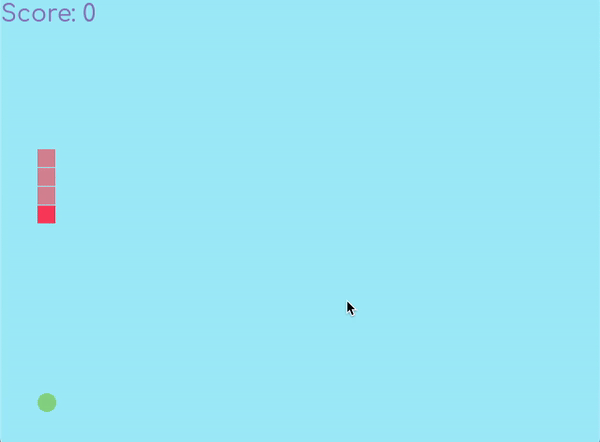

# ruby-snake

A simple Snake game written in Ruby, using the ruby2d gem.




# How to Use

First, ensure that Git and Ruby are installed on your machine. Next, run the following commands in your CLI of choice:

```bash
# Clone repo
git clone https://github.com/biefeld/ruby-snake.git ruby-snake

# Navigate to directory
cd ruby-snake

# Install gem dependencies
bundle install
```

Finally, to start up the game, use the following command:

```bash
# Start the game
ruby ruby-snake.rb
```

# Controls

- `Arrow Keys` control the snake.
- `r` will restart the game.
- `esc` or `q` will quit the application.
